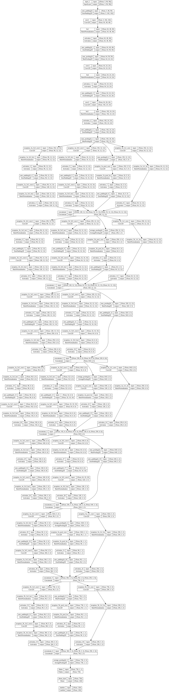

# Face_recognition_inception_v2
Se hace uso de una arquitectura inception_block_v2 (modelo predefinido), con el cual podemos hacer codificaciones de rostros respecto a empleados de una organización, de tal manera poder predecir con una sola imagen si la persona X pertenece al empleado Y de nuestra base de datos,
explicación detallada del proceso seguido en `face_recognition.ipynb`, **en el caso de una mala renderización del notebook en la visualización** puede pegar el link del notebook en **https://nbviewer.org/** o sino visualizarlo por google colab.
 
 

